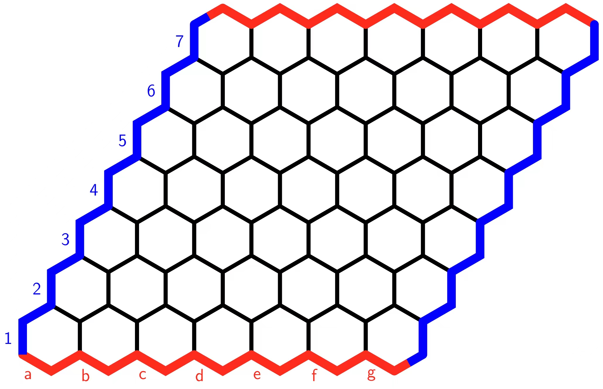

# Cachex

  

* [Cachex Rules](spec/cachex_rule.pdf)

## Part A
* [Specification](spec/spec_a.pdf)
* [Report](simple_search/report/report.pdf)
####
> Setup on Unix Machine
* <code>Host Name: dimefox.eng.unimelb.edu.au</code>
* <code>enable-python3</code>
* <code>python -m search inputs/input.json</code>
####
> Reference
* https://stackoverflow.com/questions/5084801/manhattan-distance-between-tiles-in-a-hexagonal-grid
* https://www.redblobgames.com/pathfinding/a-star/implementation.html

## Part B
* [Specification](spec/spec_b.pdf)

### Progress Check List
> 跑通下棋对战 ✔

> 构造 Opponent
* Random
* Basic Utility Function
* Same Strategy as Player

> 实现 MiniMax

> 记录对战棋局, 生成训练数据

> 实现 Alpha-Beta Pruning

> 优化 Evaluation Function

> 完成 Report

